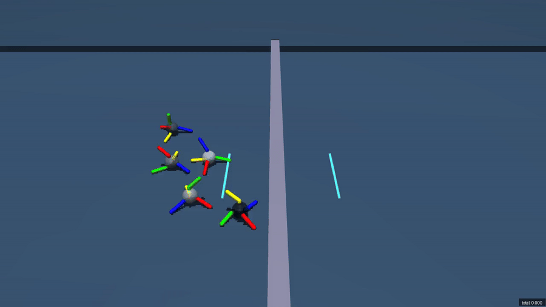
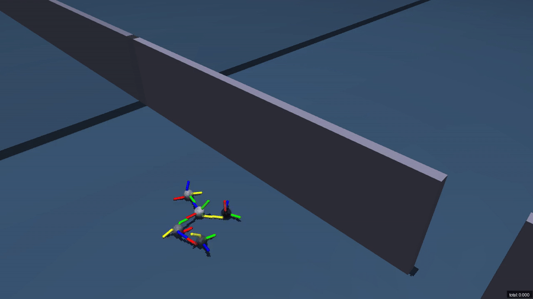

# Scenario catalog

All registered scenarios use five padded agent slots by default, while reset pools may activate four or five units. Inactive slots are identified by `agent_mask`. Scenario constructors accept keyword overrides through `make_scenario(..., **scenario_kwargs)` or `make_env(..., scenario_kwargs={...})`.

| Wall traversal | Finding an opening |
| --- | --- |
|  |  |

These demonstrations illustrate behavior, not canonical evaluation results.

| Benchmark ID | Category | Terminal success metric |
| --- | --- | --- |
| `SwarmBots-WallEasy-v0` | fixed 0.2 m wall | yes |
| `SwarmBots-WallMedium-v0` | fixed 0.3 m wall | yes |
| `SwarmBots-WallHard-v0` | fixed 0.4 m wall | yes |
| `SwarmBots-POWallEasy-v0` | randomized hidden 0.25 m wall | yes |
| `SwarmBots-POWallMedium-v0` | randomized hidden 0.3 m wall | yes |
| `SwarmBots-Bridge-v0` | narrow bridge traversal | yes |
| `SwarmBots-FindOpening-v0` | hidden-opening exploration | yes |
| `SwarmBots-Climb-v0` | platform climbing | yes |
| `SwarmBots-VerticalReach-v0` | elevated goal reaching | yes |
| `SwarmBots-PayloadPlane-v0` | single-payload transport | no; report return |
| `SwarmBots-PayloadStep-v0` | payload transport over a step | yes |
| `SwarmBots-DualPayloadPlane-v0` | two-payload transport | no; report return |
| `SwarmBots-MultiPayloadGoal-v0` | variable payload-to-goal assignment | yes |
| `SwarmBots-MoveTo-v0` | sampled-goal navigation | no; report return |

## Observation contract

`local_obs` contains proprioception, connection state, and optional connector positions for every agent. `global_obs` contains shared task features that the actor is allowed to observe. `agent_mask` distinguishes active units from padding.

`hidden_local_vars` and `hidden_global_vars` are explicitly privileged. They support centralized critics, auxiliary losses, and diagnostics, but using them as actor inputs invalidates a benchmark result. The official evaluator removes both keys before invoking a policy.

For the default four-limb, eight-hinge robot, each agent's `local_obs` has 71 float32 features, concatenated in this order (Python slice notation):

| Slice | Meaning |
| --- | --- |
| `0:3` | Root position `(x, y, z)` in world coordinates, metres |
| `3:9` | Root orientation: first two rotation-matrix columns, each in `(x, y, z)` order |
| `9:25` | Eight hinge angles as interleaved `(sin(angle), cos(angle))` pairs |
| `25:39` | MuJoCo generalized velocity order: root linear velocity (m/s), root angular velocity (rad/s), then hinge velocities (rad/s) |
| `39:59` | Four connector records: `(disconnected, connected, sin(twist), cos(twist), disconnect_potential)` |
| `59:71` | Four connector positions in world coordinates, metres, flattened `(x, y, z)` |

Twist sine/cosine are zero when no valid connection exists. Disconnect potential is an accumulated control quantity, not a physical measurement. Use `agent_mask` to exclude inactive slots; custom joint/observation settings change these offsets. Actions use the same hinge and connector ordering as their observation records.

Shared task features in `global_obs` are positions in world coordinates unless stated otherwise:

| Task | Shared features |
| --- | --- |
| Wall, PO Wall, Bridge, FindOpening | Empty; privileged obstacle information is not actor input |
| Climb, VerticalReach | Goal position `(x, y, z)` |
| MoveTo | Goal position `(x, y)` |
| PayloadPlane, PayloadStep | Payload position `(x, y, z)`, followed by its six-dimensional orientation |
| DualPayloadPlane | Two consecutive payload position/orientation records |
| MultiPayloadGoal | One 12-feature record per payload slot: active flag, position (3), orientation (6), goal `(x, y)` |

Inactive MultiPayloadGoal records have zero positions/goals and identity orientation. These payload masks are separate from `agent_mask`. Query `env.single_observation_space` and `env.single_action_space` for the selected task; the corresponding spaces without `single_` include the world dimension.

## Success and termination

Success is a team-level boolean. Padding never counts toward success. For success-enabled tasks, `info["success"]` refers to the episode that just stepped, including its terminal step before SAME_STEP reset.

| Task | Success condition |
| --- | --- |
| Wall and PO Wall | Every active unit has `y > wall_y + wall_success_threshold` |
| Bridge | Every active unit has `y > success_y`, with no active unit below `fall_z_threshold` |
| FindOpening | Every active unit has `y > wall_y + opening_y_margin` |
| Climb | Every active unit's root lies within `goal_radius` of the 3D goal |
| VerticalReach | At least one active unit's root lies inside the goal box |
| PayloadStep | Payload centre reaches `payload_success_y` and the required height above the step |
| MultiPayloadGoal | Every active payload centre lies within `goal_radius` of its assigned 3D goal (goal height is the payload radius) |

PayloadPlane, DualPayloadPlane, and MoveTo have no success metric; report return. Episodes truncate at 500 control steps by default. Success terminates an episode for the success-enabled tasks; bridge falls and nonfinite simulator state can also terminate unsuccessfully. The default control period is `0.003 * 10 = 0.03` seconds. Reward terms are exposed in `info["reward_terms"]`; weights and thresholds are in `env.get_settings()` and exported evaluation metadata.

## Action contract

`actuators` are continuous values in `[-1, 1]`. `connectors` are continuous by default: positive values accumulate connection intent and negative values accumulate disconnection intent. Scenarios can still be constructed with `continuous_connector_actions=False` for ablations, but those results are not directly comparable to the registered defaults.

## Scenario customization

The registry fixes defaults, not the implementation. Custom variants remain easy to construct:

```python
from swarmbots import make_env

env = make_env(
    "SwarmBots-POWallMedium-v0",
    num_envs=128,
    device="cuda",
    scenario_kwargs={
        "wall_height": 0.35,
        "continuous_connector_actions": False,
    },
)
```

Treat any override as a new task. Report every override and do not label the result with the unchanged canonical benchmark ID.
